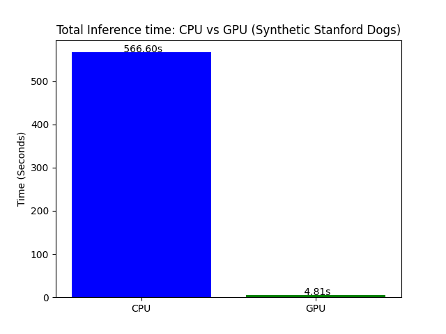

# Inference Benchmark Test (GPU vs CPU)
This repository contains a script to benchmark the inference performance of a pretrained ResNet50 model using synthetic data. The script measures and compares inference times on CPU and GPU.

## Features
-	Generates synthetic image data and labels.
-	Uses a pretrained ResNet50 model for inference.
-	Benchmarks inference times on CPU and GPU (if available).
-	Visualizes the results with a bar chart.

## Requirements
- Python 3.x
- PyTorch
- torchvision
- matplotlib

## Example Output
- CPU Inference Time: X.XX seconds
- GPU Inference Time: Y.YY seconds
- Speedup: Z.ZZx

